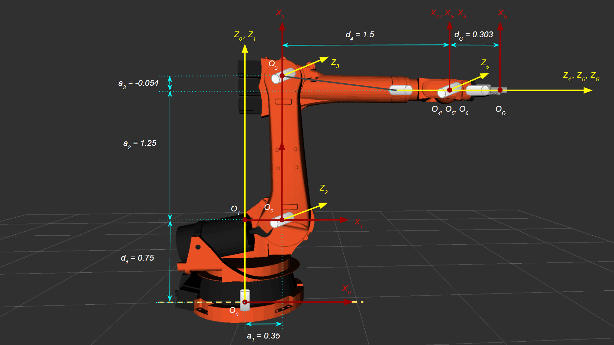

# Udacity Robotics Nanodegree - Robot Arm - Pick And Place Project

## Kinematic analysis

### Forward kinematics

To perform forward kinematics, we need to obtain the following DH
parameters:

*  **Twist angle (*&alpha;i - 1*)** - The angle between
   ***Zi - 1*** and ***Zi*** axes measured about
   the ***Xi - 1*** axis in a right-hand sense.
*  **Link length (*ai - 1*)** - The distance between
   ***Zi - 1*** and ***Zi*** axes measured along
   the ***Xi*** axis.
*  **Link offset (*di*)** - The signed distance between
   ***Xi - 1*** and ***Xi*** axes measured along
   the ***Zi*** axis.
*  **Joint variables (*&theta;i*)** - The angle between
   ***Xi - 1*** and ***Xi*** axes measured about
   the ***Zi*** axis in a right-hand sense.

**Figure**: Annotated robot arm

The following table shows the DH parameter values obtained using the
URDF file.

**Table**: DH Parameters

|  i  | *&alpha;i - 1* | *a i - 1* | *di* | *&theta;i*        |
| :-: | ------------------------: | -------------------: | --------------: | ---------------------------: |
| 1   | 0                         | 0                    | 0.75            | &theta;1          |
| 2   | - &pi;/2                  | 0.35                 | 0               | &theta;2 - &pi;/2 |
| 3   | 0                         | 1.25                 | 0               | &theta;3          |
| 4   | - &pi;/2                  | - 0.054              | 1.5             | &theta;4          |
| 5   | &pi;/2                    | 0                    | 0               | &theta;5          |
| 6   | - &pi;/2                  | 0                    | 0               | &theta;6          |
| G   | 0                         | 0                    | 0.303           | 0                            |

### Transformation matrices

To transform the reference frame from joint *i - 1* to joint *i* four
transformations need to be performed (2 rotations and 2 translations) in
the following order:

1. Rotate about the *X* axis by an angle of *&alpha;i - 1*.
2. Translate along the *X* axis by a length of *ai - 1*.
3. Rotate about the *Z* axis by an angle of *&theta;i*.
4. Translate about the *Z* axis by a length of *di*.

The total transformation from frame *i - 1* to *i* can be written as

***i - 1i T =
RX(&alpha;i - 1)
DX(ai - 1)
RZ(&theta;i)
DX(di)***

The resulting Homogeneous Transformation matrix is

***i - 1i T =&#9;\[\[ &#9;cos(&theta;i), &#9; &nbsp; &nbsp; &nbsp; &nbsp; &nbsp; &nbsp;-sin(&theta;i), &#9;&#9;0, &#9; &nbsp; &nbsp;ai - 1 ]***  
&#9; ***\[ sin(&theta;i)cos(&alpha;i - 1), &nbsp; cos(&theta;i)cos(&alpha;i - 1), &#9; &nbsp; &nbsp; -sin(&alpha;i - 1), &nbsp; &nbsp; &nbsp;-sin(&alpha;i - 1) di]***  
&#9; ***\[ sin(&theta;i)cos(&alpha;i - 1), &nbsp; cos(&theta;i)cos(&alpha;i - 1),&#9; &nbsp; &nbsp; cos(&alpha;i - 1), &nbsp; &nbsp; &nbsp; cos(&alpha;i - 1) di]***  
&#9; ***\[ &#9; &nbsp; &nbsp; &nbsp; &nbsp; 0, &#9; &#9;&nbsp; &nbsp;0, &#9;&#9;0, &#9;&nbsp; &nbsp;&nbsp; &nbsp; &nbsp; 1]]***  

By substituting the values for *&theta;i*,
*ai - 1*, *&alpha;i - 1* and *di* with
the values in the DH parameters  for each link we get the following
simplified matrices:

***01T = &#9;\[\[ cos(&theta;1), &#9;-sin(&theta;1), &#9;0, &#9;0]***  
***&#9; \[ sin(&theta;1), &#9;cos(&theta;1), &#9;0, &#9;0]***  
***&#9; \[ &nbsp; &nbsp; &nbsp; &nbsp; &nbsp; 0, &#9; &nbsp; &nbsp; &nbsp; &nbsp; &nbsp;0, &#9;1, &nbsp; &nbsp; &nbsp; &nbsp; &nbsp;0.75]***  
***&#9; \[ &nbsp; &nbsp; &nbsp; &nbsp; &nbsp; 0, &#9; &nbsp; &nbsp; &nbsp; &nbsp; &nbsp;0, &#9;0,    &#9;1]]***  

***12T = &#9;\[\[ sin(&theta;2), &#9;cos(&theta;2), &#9;0, &nbsp; &nbsp; &nbsp; &nbsp; &nbsp;0.35]***  
***&#9; \[ &nbsp; &nbsp; &nbsp; &nbsp; &nbsp; 0, &#9; &nbsp; &nbsp; &nbsp; &nbsp; &nbsp;0, &#9;1, &#9;0]***  
***&#9; \[ cos(&theta;2), &#9;-sin(&theta;2), &#9;0, &#9;0]***  
***&#9; \[ &nbsp; &nbsp; &nbsp; &nbsp; &nbsp; 0, &#9; &nbsp; &nbsp; &nbsp; &nbsp; &nbsp;0, &#9;0,    &#9;1]]***

***23T = &#9;\[\[ cos(&theta;3), &#9;-sin(&theta;3), &#9;0, &nbsp; &nbsp; &nbsp; &nbsp; &nbsp;1.25]***  
***&#9; \[ sin(&theta;3), &#9;cos(&theta;3), &#9;0, &#9;0]***  
***&#9; \[ &nbsp; &nbsp; &nbsp; &nbsp; &nbsp; 0, &#9; &nbsp; &nbsp; &nbsp; &nbsp; &nbsp;0, &#9;1, &#9;0]***  
***&#9; \[ &nbsp; &nbsp; &nbsp; &nbsp; &nbsp; 0, &#9; &nbsp; &nbsp; &nbsp; &nbsp; &nbsp;0, &#9;0,    &#9;1]]***  

***34T = &#9;\[\[  cos(&theta;4), &#9;-sin(&theta;4), &#9;0, &nbsp; &nbsp; &nbsp;-0.054]***  
***&#9; \[ &nbsp; &nbsp; &nbsp; &nbsp; &nbsp;0, &#9; &nbsp; &nbsp; &nbsp; &nbsp; &nbsp;0, &#9;1,  &nbsp; &nbsp; &nbsp; &nbsp; &nbsp; 1.5]***  
***&#9; \[-sin(&theta;4),&nbsp;-cos(&theta;4), &#9;0,&nbsp; &nbsp; &nbsp; &nbsp; &nbsp; &nbsp; &nbsp; 0]***  
***&#9; \[ &nbsp; &nbsp; &nbsp; &nbsp; &nbsp; 0, &#9; &nbsp; &nbsp; &nbsp; &nbsp; 0, &#9;0,    &#9;1]]***  

***45T = &#9;\[\[ cos(&theta;5), -sin(&theta;5), &#9;0, &#9;0]***  
***&#9; \[ &nbsp; &nbsp; &nbsp; &nbsp; &nbsp; 0, &#9; &nbsp; &nbsp; &nbsp; &nbsp; 0, &#9;-1, &#9;0]***  
***&#9; \[ sin(&theta;5), &nbsp;cos(&theta;5), &#9;0, &#9;0]***  
***&#9; \[ &nbsp; &nbsp; &nbsp; &nbsp; &nbsp; 0, &#9; &nbsp; &nbsp; &nbsp; &nbsp; 0, &#9;0,    &#9;1]]***  

***56T = &#9;\[\[ cos(&theta;6), -sin(&theta;6), &#9;0, &#9;0]***  
***&#9; \[ &nbsp; &nbsp; &nbsp; &nbsp; &nbsp; 0, &#9; &nbsp; &nbsp; &nbsp; &nbsp; 0, &#9;1, &#9;0]***  
***&#9; \[ -sin(&theta;6),-cos(&theta;6), &#9;0, &#9;0]***  
***&#9; \[ &nbsp; &nbsp; &nbsp; &nbsp; &nbsp; 0, &#9; &nbsp; &nbsp; &nbsp; &nbsp; 0, &#9;0,    &#9;1]]***  

***6GT = &#9;\[\[ &nbsp; &nbsp; &nbsp; &nbsp; &nbsp; 1, &#9; &nbsp; &nbsp; &nbsp; &nbsp; 0, &#9;0, &#9;0]***  
***&#9; \[ &nbsp; &nbsp; &nbsp; &nbsp; &nbsp; 0, &#9; &nbsp; &nbsp; &nbsp; &nbsp; 1, &#9;0, &#9;0]***  
***&#9; \[ &nbsp; &nbsp; &nbsp; &nbsp; &nbsp; 0, &#9; &nbsp; &nbsp; &nbsp; &nbsp; 0, &#9;1, &nbsp; &nbsp; &nbsp; &nbsp;0.303]***  
***&#9; \[ &nbsp; &nbsp; &nbsp; &nbsp; &nbsp; 0, &#9; &nbsp; &nbsp; &nbsp; &nbsp; 0, &#9;0,    &#9;1]]***  

#### Generalized homogeneous transform between base_link and gripper_link

The transform from the base link to the gripper can be obtained using
the roll, pitch and yaw values in the gripper pose by multiplying the
rotation matrices RX(roll), RY(pitch) and
RZ(yaw).

***Trpy = &#9;\[\[ &#9; &#9; &nbsp; cos(P)\*cos(Y), &#9; &#9; &nbsp; &nbsp; &nbsp; &nbsp; &nbsp; &nbsp;-sin(Y)\*cos(P), &#9;sin(P), &#9; Px]***  
***&#9; \[ sin(P)\*sin(R)\*cos(Y) + sin(Y)\*cos(R), &nbsp; -sin(P)\*sin(R)\*sin(Y) + cos(R)\*cos(Y), &nbsp; &nbsp;-sin(R)\*cos(P), &#9; Py]***  
***&#9; \[-sin(P)\*cos(R)\*cos(Y) + sin(R)\*sin(Y), &nbsp; sin(P)\*sin(Y)\*cos(R) + sin(R)\*cos(Y), &nbsp; &nbsp; &nbsp;cos(P)\*cos(R), &#9; Pz]***  
***&#9; \[ &nbsp; &nbsp; &nbsp; &nbsp; &nbsp; 0, &#9; &nbsp; &nbsp; &nbsp; &nbsp; 0, &#9;0,    &#9;1]]***  

The rotation still needs to be corrected to align it with the gripper
frame. The resulting frame from the transform above should be rotated
intrinsically by *-&pi;/2* along the *Y* axis and then by *&pi;* radians
along the *Z* axis.

***Tcorr = RZ(&pi;) \* RY(-&pi;/2)***

***Tcorr = &#9;\[\[ 0, &#9;0, &#9;1, &#9;0]***  
***&#9; \[ 0, &#9;-1, &#9;0, &#9;0]***  
***&#9; \[ 1, &#9;0, &#9;0, &#9;0]***  
***&#9; \[ 0, &#9;0, &#9;0,    &#9;1]]***  

the generalized transform is given by
***Ttotal = Trpy \* Tcorr*** .

***Ttotal = &#9;\[\[ &nbsp; &nbsp;  &nbsp; &nbsp;  &nbsp; &nbsp; sin(P), &#9; &#9; &nbsp; &nbsp; &nbsp; &nbsp; &nbsp; sin(Y)\*cos(P), &#9; &#9; &#9; cos(P)\*cos(Y), &#9; Px]***  
***&#9; \[ sin(R)\*cos(P), &nbsp; sin(P)\*sin(R)\*sin(Y) - cos(R)\*cos(Y), &nbsp; sin(P)\*sin(R)\*cos(Y) + sin(Y)\*cos(R), &#9; Py]***  
***&#9; \[cos(P)\*cos(R), &nbsp;-sin(P)\*sin(Y)\*cos(R) - sin(R)\*cos(Y), &nbsp;-sin(P)\*cos(R)\*cos(Y) + sin(R)\*sin(Y), &#9; Pz]***  
***&#9; \[ &#9; &nbsp; &nbsp;0, &#9; &#9; &#9;&nbsp; &nbsp; &nbsp; &nbsp; &nbsp; &nbsp; &nbsp;0, &#9; &#9; &#9; &#9; &nbsp; 0, &#9; &nbsp;1]]***  

### Inverse Kinematics

