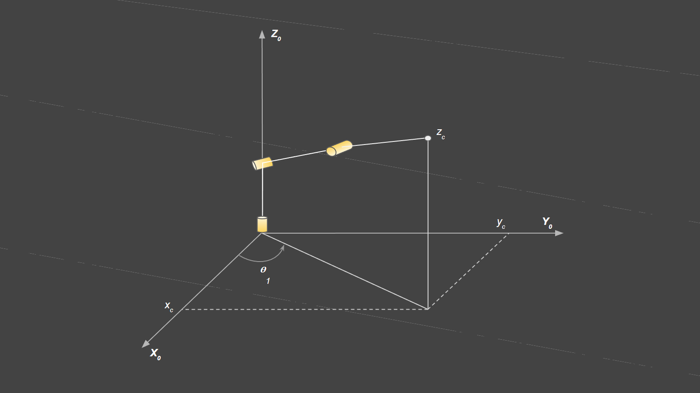
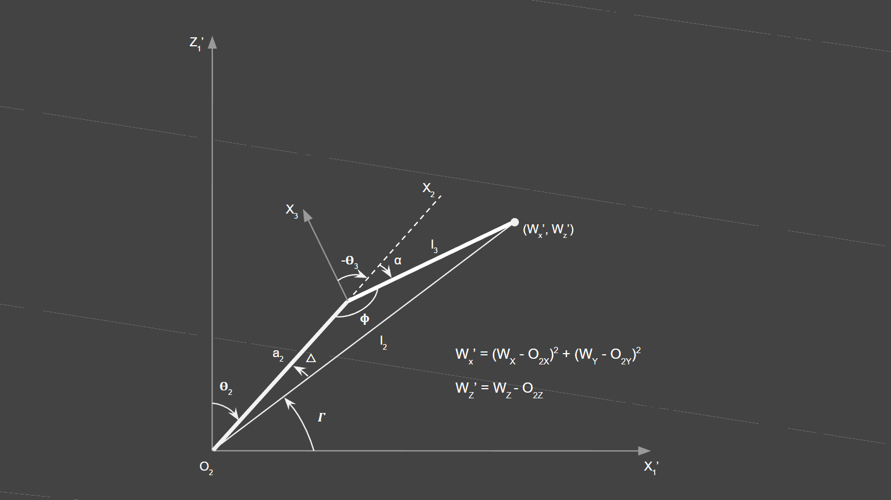

# Udacity Robotics Nanodegree - Robot Arm - Pick And Place Project

## Kinematic analysis

### Forward kinematics

To perform forward kinematics, we need to obtain the following DH
parameters:

*  **Twist angle (*&alpha;<sub>i - 1</sub>*)** - The angle between
   ***Z<sub>i - 1</sub>*** and ***Z<sub>i</sub>*** axes measured about
   the ***X<sub>i - 1</sub>*** axis in a right-hand sense.
*  **Link length (*a<sub>i - 1</sub>*)** - The distance between
   ***Z<sub>i - 1</sub>*** and ***Z<sub>i</sub>*** axes measured along
   the ***X<sub>i</sub>*** axis.
*  **Link offset (*d<sub>i</sub>*)** - The signed distance between
   ***X<sub>i - 1</sub>*** and ***X<sub>i</sub>*** axes measured along
   the ***Z<sub>i</sub>*** axis.
*  **Joint variables (*&theta;<sub>i</sub>*)** - The angle between
   ***X<sub>i - 1</sub>*** and ***X<sub>i</sub>*** axes measured about
   the ***Z<sub>i</sub>*** axis in a right-hand sense.

**Figure**: Annotated robot arm


The following table shows the DH parameter values obtained using the
URDF file.

**Table**: DH Parameters

|  i  | *&alpha;<sub>i - 1</sub>* | *a <sub>i - 1</sub>* | *d<sub>i</sub>* | *&theta;<sub>i</sub>*        |
| :-: | ------------------------: | -------------------: | --------------: | ---------------------------: |
| 1   | 0                         | 0                    | 0.75            | &theta;<sub>1</sub>          |
| 2   | - &pi;/2                  | 0.35                 | 0               | &theta;<sub>2</sub> - &pi;/2 |
| 3   | 0                         | 1.25                 | 0               | &theta;<sub>3</sub>          |
| 4   | - &pi;/2                  | - 0.054              | 1.5             | &theta;<sub>4</sub>          |
| 5   | &pi;/2                    | 0                    | 0               | &theta;<sub>5</sub>          |
| 6   | - &pi;/2                  | 0                    | 0               | &theta;<sub>6</sub>          |
| G   | 0                         | 0                    | 0.303           | 0                            |

### Transformation matrices

To transform the reference frame from joint *i - 1* to joint *i* four
transformations need to be performed (2 rotations and 2 translations) in
the following order:

1. Rotate about the ***X*** axis by an angle of
   **&alpha;<sub>i - 1</sub>**.
2. Translate along the ***X*** axis by a length of
   **a<sub>i - 1</sub>**.
3. Rotate about the ***Z*** axis by an angle of
   **&theta;<sub>i</sub>**.
4. Translate about the ***Z*** axis by a length of **d<sub>i</sub>**.

The total transformation from frame ***i - 1*** to ***i*** can be
written as

***<sup>i - 1</sup><sub>i</sub> T =
R<sub>X</sub>(&alpha;<sub>i - 1</sub>)
D<sub>X</sub>(a<sub>i - 1</sub>)
R<sub>Z</sub>(&theta;<sub>i</sub>)
D<sub>X</sub>(d<sub>i</sub>)***

The resulting Homogeneous Transformation matrix is

```
T = Matrix[[            cos(θi),           -sin(θi),            0,          a(i - 1)],
           [ sin(θi)cos(αi - 1), cos(θi)cos(αi - 1), -sin(αi - 1), -sin(αi - 1) * di],
           [ sin(θi)cos(αi - 1), cos(θi)cos(αi - 1),  cos(αi - 1),  cos(αi - 1) * di],
           [                  0,                  0,            0,                 1]]
```

By substituting the values for **&theta;<sub>i</sub>**,
**a<sub>i - 1</sub>**, ***&alpha;<sub>i - 1</sub>*** and
***d<sub>i</sub>*** with the values in the DH parameters  for each link
we get the following simplified matrices:

```
T0_1 = Matrix[[ cos(θ1),   -sin(θ1),    0,      0],
              [ sin(θ1),    cos(θ1),    0,      0],
              [       0,          0,    1,   0.75],
              [       0,          0,    0,      1]]

T1_2 = Matrix[[ sin(θ2),    cos(θ2),    0,  0.035],
              [       0,          0,    1,      0],
              [ cos(θ2),   -sin(θ2),    0,      0],
              [       0,          0,    0,      1]]

T2_3 = Matrix[[ cos(θ3),   -sin(θ3),    0,   1.25],
              [ sin(θ3),    cos(θ3),    0,      0],
              [       0,          0,    1,      0],
              [       0,          0,    0,      1]]

T3_4 = Matrix[[ cos(θ4),   -sin(θ4),    0, -0.054],
              [       0,          0,    1,    1.5],
              [-sin(θ4),   -cos(θ4),    0,      0],
              [       0,          0,    0,      1]]

T4_5 = Matrix[[ cos(θ5),   -sin(θ5),    0,      0],
              [       0,          0,   -1,      0],
              [ sin(θ5),    cos(θ5),    0,      0],
              [       0,          0,    0,      1]]

T5_6 = Matrix[[ cos(θ6),   -sin(θ6),    0,      0],
              [       0,          0,    1,      0],
              [-sin(θ1),   -cos(θ1),    0,      0],
              [       0,          0,    0,      1]]

T6_G = Matrix[[       1,          0,    0,      0],
              [       0,          1,    0,      0],
              [       0,          0,    1,  0.303],
              [       0,          0,    0,      1]]
```

#### Generalized homogeneous transform between base_link and gripper_link

The transform from the base link to the gripper can be obtained using
the roll, pitch and yaw values in the gripper pose by multiplying the
rotation matrices R<sub>X</sub>(roll), R<sub>Y</sub>(pitch) and
R<sub>Z</sub>(yaw).

```
Trpy = Matrix[[                        cos(P)*cos(Y),                         -sin(Y)*cos(P),           sin(P),     Px],
              [ sin(P)*sin(R)*cos(Y) + sin(Y)*cos(R),  -sin(P)*sin(R)*sin(Y) + cos(R)*cos(Y),   -sin(R)*cos(P),     Py],
              [-sin(P)*cos(R)*cos(Y) + sin(R)*sin(Y),   sin(P)*sin(Y)*cos(R) + sin(R)*cos(Y),    cos(P)*cos(R),     Pz],
              [                                    0,                                      0,                0,      1]]
```

The rotation still needs to be corrected to align it with the gripper
frame. The resulting frame from the transform above should be rotated
intrinsically by *-&pi;/2* along the *Y* axis and then by *&pi;* radians
along the *Z* axis.

***T<sub>corr</sub> = R<sub>Z</sub>(&pi;) \* R<sub>Y</sub>(-&pi;/2)***

```
Tcorr = Matrix[[ 0,  0,  1,  0],
               [ 0, -1,  0,  0],
               [ 1,  0,  0,  0],
               [ 0,  0,  0,  1]]
```

the generalized transform is given by
***T<sub>total</sub> = T<sub>rpy</sub> \* T<sub>corr</sub>*** .

```
Ttotal = Matrix[[        sin(P),                         sin(Y)*cos(P),                         cos(P)*cos(Y),  Px],
                [ sin(R)*cos(P),  sin(P)*sin(R)*sin(Y) - cos(R)*cos(Y),  sin(P)*sin(R)*cos(Y) + sin(Y)*cos(R),  Py],
                [ cos(P)*cos(R), -sin(P)*sin(Y)*cos(R) - sin(R)*cos(Y), -sin(P)*cos(R)*cos(Y) + sin(R)*sin(Y),  Pz],
                [             0,                                     0,                                     0,   1]]
```

### Inverse kinematics

The first step in solving the Inverse Kinematics (IK) problem is to
calculate the wrist center pose relative to the base frame using the
given end-effector (gripper) pose.

We can use the `Trpy` defined in the
[Generalized homogeneous transform](#generalized-homogeneous-transform-between-base_link-and-gripper_link)
section above to get the vector the end effector is pointing to. The
end effector is pointed along the ***X axis*** of the new frame. The
columns of a rotation matrix form the basis vectors of the new frame
relative to the base frame. This property can be used to translate along
the ***X axis*** of the gripper's frame.

```
# Get wrist center position.
wx = px - (s[d6] + s[d7]) * R0_G[0, 0]
wy = py - (s[d6] + s[d7]) * R0_G[1, 0]
wz = pz - (s[d6] + s[d7]) * R0_G[2, 0]
```

The first joint angle can be calculated by rotating the joint to point
towards the wrist center. Imagine a vector from origin of the base frame
to the projection of the wrist center on the x-y plane. The rotation
angle is the angle between this vector and the x-axis, indicated as
***&theta;<sub>1</sub>*** in the image below:

**Figure**: &theta;<sub>1</sub> angle



```
theta1 = atan2(wy, wx)
```

Next, to to calculate the ***&theta;<sub>2</sub>*** and
***&theta;<sub>3</sub>*** angles, we need to find the origin of joint 2.
We can substitute the ***&theta;<sub>1</sub>*** value calculated in the
homogeneous transformation matrix ***<sup>0</sup><sub>2</sub>T*** to
find the origin of joint 2 as shown below:

```
# Find the origin of the second link using theta1
t0_2 = T0_2.evalf(subs={q1: theta1})
o2 = [t0_2[0, 3], t0_2[1, 3], t0_2[2, 3]]
```

Imagine the plane containing link 2 and link 3. This plane can be used
to create a new 2D reference frame (XZ axes) with ***O<sub>2</sub>***
as the origin as shown in the figure below:



The ***Z<sub>1</sub>'*** axis is parallel to ***Z<sub>1</sub>*** and the
***X<sub>1</sub>'*** axis is parallel to the vector used to calculate
***&theta;<sub>1</sub>*** .

To calculate ***&theta;<sub>3</sub>*** , we should first find
***&alpha;*** .

***&alpha; = &pi; - &Phi;***

***cos(&alpha;) = cos(&pi; - &Phi;)***

***cos(&alpha;) = - cos(&Phi;)***

Using cosine rule, we can find ***cos{&Phi;)*** .

***cos{&Phi;) = (a<sub>2</sub><sup>2</sup> + l<sub>3</sub><sup>2</sup> - l<sub>2</sub><sup>2</sup>) / (2 \* a<sub>2</sub> \* l<sub>3</sub>)***

which gives us ***cos(&alpha;)*** as:

***cos(&alpha;) = (l<sub>2</sub><sup>2</sup> - a<sub>2</sub><sup>2</sup> - l<sub>3</sub><sup>2</sup>) / (2 \* a<sub>2</sub> \* l<sub>3</sub>) := D***

We can get ***&alpha;*** using ***acos***, but the sign of the angle
would be ambiguous. If we were able to calculate ***sin(&alpha;)*** we
would be able to use ***atan2*** to get a signed angle.

Using ***sin(&alpha;) = (1 - cos<sup>2</sup>(&alpha;))<sup>1/2</sup>***

we get ***&alpha; = atan2((1 - D<sup>2</sup>)<sup>1/2</sup>, D)***

```
D1 = (l2**2 - s[a2]**2 - l3**2) / (2 * s[a2] * l3)
D1 = np.clip(D1, None, 1.0)  # Avoids getting imaginary numbers.

alpha = atan2(sqrt(1 - D1**2), D1)
```
